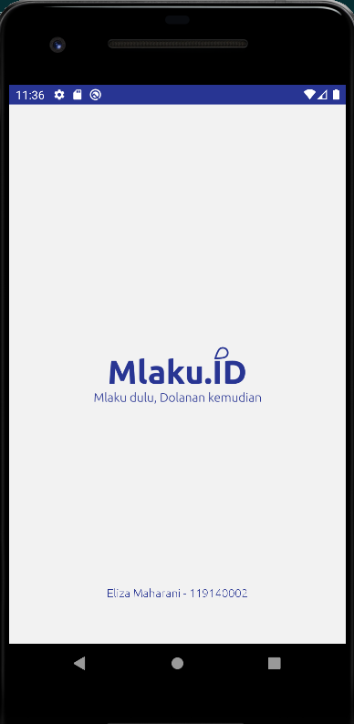
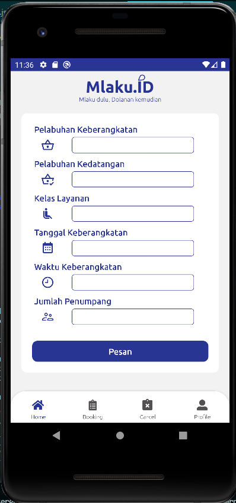

# UTS-PAM-ELIZA
UTS PAM ELIZA 2022

Pada uts kali ini saya menerapkan banyak modul seperti :

`@react-navigation/bottom-tabs` untuk membantu dalam pembuatan bottom navigator
`@react-navigation/native-stack` untuk membantu dalam penerapan stack screen
`@react-navigation/native` untuk membantu dalam navigasi yang dilakukan selama di dalam Apps
`@react-native-community/datetimepicker` membantu dalam pembuatan dan pengambilan tanggal dan waktu
`react-native-vector-icons` membantu dalam pengaplikasian icon yang akan dipakai pada Apps

Dalam aplikasi mlaku ini saya menggunakan beberapa component seperti :
Text : untuk mengeluarkan text
SafeAreaView: untuk mengimplementasikan area aman tampilan
View: untuk mengelompokkan beeberapa component lainnya
Pressable : pengganti button yang mudah untuk dilakukan styling
Image : untuk memunculkan image
StatusBar: untuk melakukan styling pada statusbar yang ada
ScrollView : membantu tampilan agar dapat di scroll
Modal : untuk menampilkan modal yang digunakan

semua icon yang digunakan berasal dari Material Community Icons. 
Aplikasi MlakuID merupakan sebuah Aplikasi yang bertujuan untuk memabntu dalam pemesanan tiket kapal secara digital. MlakuId dapat melakukan pemesanan tiket secara digital, selain itu juga dapat melakukan pembatalan, serta melihat riwayat pemesanan. 

Namun dikarenakan keterbatasan dan kekurangan saya dalam merancang Aplikasi ini maka sedikit banyak terdapat kekurangan dalam perancangan selain itu karena Kesempurnaan merupakan lagu dari rizky febian :). Semoga dari perancangan aplikasi mlakuId yang masih memiliki banyak kekurangan ini saya dapat mengambil pelajarannya seperti belajar menahan lapar karena harus mengerjakan tugas ini. :)

